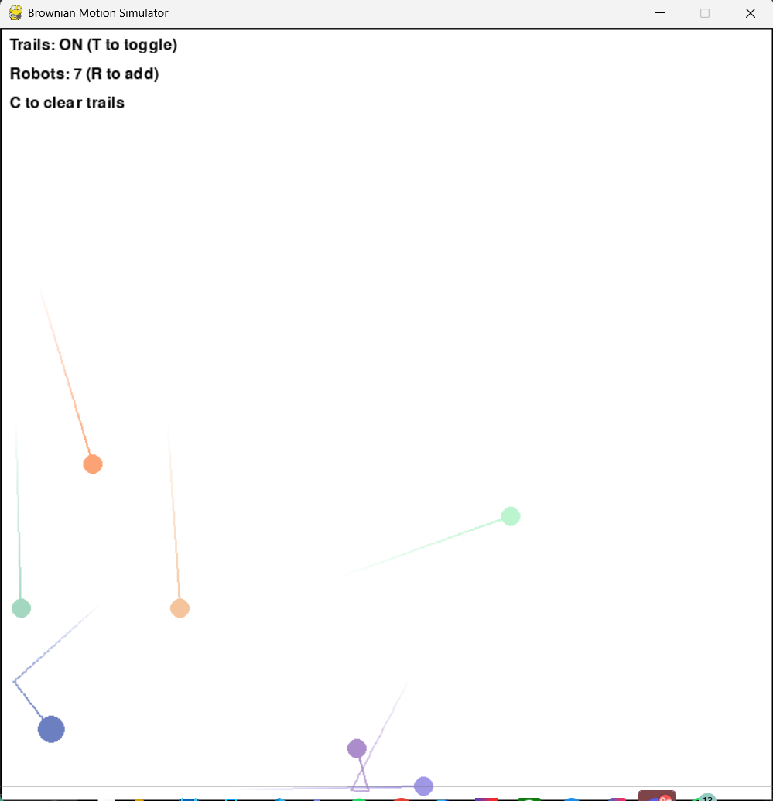

# Brownian Motion Robot Simulation

This project implements a simulation of Brownian motion for robots. The simulation shows robots moving in a square arena exhibiting Brownian motion behavior.


## Features

- Modular Python implementation with separate modules for robot behavior and simulation
- Interactive visualization using pygame
- Multiple customization options:
  - Show/hide robot trails
  - Add multiple robots with different characteristics
  - Customizable arena size and robot parameters
  - Record simulations as GIFs for documentation

## Requirements

- Python 3.6+
- numpy
- pygame
- imageio (optional, for GIF generation)

## Installation

1. Clone the repository
2. Install dependencies:

```bash
pip install numpy pygame
pip install imageio  # optional, for GIF generation
```

## Project Structure

- `robot.py`: Defines the Robot class with Brownian motion behavior
- `brownian_simulator.py`: Implements the simulation environment and visualization
- `app.py`: Main application for running the simulation interactively
- `gif_generator.py`: Utility script for generating demonstration GIFs

## Usage

### Interactive Mode

Run the simulation interactively:

```bash
python app.py
```

Controls:

- `T`: Toggle trail visibility
- `R`: Add a new robot
- `C`: Clear all trails
- `ESC`: Quit simulation

### Command Line Options

```
python app.py [options]

options:
  --width WIDTH          Width of the arena
  --height HEIGHT        Height of the arena
  --robots ROBOTS        Number of robots
  --trails               Show trails
  --trail-length LENGTH  Length of trails
  --fps FPS              Frames per second
  --record               Record and save as GIF
  --frames FRAMES        Number of frames to record
  --output OUTPUT        Output filename for GIF
```

### Examples

Run a simulation with 3 robots and trails:

```bash
python app.py --robots 3 --trails
```

Record a GIF with 5 robots:

```bash
python app.py --robots 5 --trails --record --output brownian_five_robots.gif
```

Generate multiple demonstration GIFs:

```bash
python gif_generator.py
```

## Demo GIFs

The following GIFs demonstrate different aspects of the Brownian motion simulation, Check them out in output_gifs

- `single_robot.gif`: Single robot with trail showing basic Brownian motion
- `multiple_robots.gif`: Five robots showing emergent patterns
- `no_trails.gif`: Three robots without trails
- `long_trails.gif`: Two robots with long trails showing extensive movement patterns
- `small_arena.gif`: Three robots in a smaller arena showing increased collision frequency

## Implementation Details

The simulation follows the steps outlined in the challenge:

1. Each robot is represented as a circle
2. The simulation takes place in a square arena
3. Robots start near the center and move straight initially
4. Upon collision with boundaries, robots rotate for a random duration
5. After rotation, robots continue moving in the new direction

## Robot Behavior

The `Robot` class implements:

- Forward motion along the current direction
- Collision detection with arena boundaries
- Random rotation after collision
- Position tracking for trail visualization

## License

[MIT License](LICENSE)
